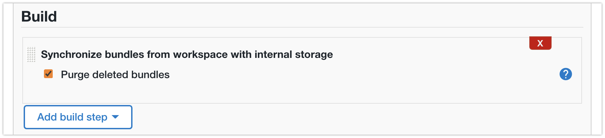

# Configuration As Code

This is about [Configuration as Code for CloudBees CI for Controllers](https://docs.cloudbees.com/docs/cloudbees-ci/latest/casc-controller/).

There is a subfolder named `casc-for-oc`, containing examples and information for [Configuration as Code for CloudBees CI for Operations Center](https://docs.cloudbees.com/docs/cloudbees-ci/latest/casc-oc/)


## Up-to-date Bundles

Due to some rework, not all Bundles are up-to-date to the October 2021 release of CloudBees CI.
These Bundles are:

* `shared`: a "parent" Bundle to inherit from
* `mc1`: a minimal Bundle, configuring as little as possible (very limited plugin set)
* `mc21`: more elaborate Bundle, adding a lot more plugins (such as BlueOcean)

## Steps

* install a git client on Operations Center
    * for example: `github-branch-source`
* create a Freestyle job
    * check out from your repository with the casc Bundles
    * use the `Synchronize bundles from workspace with internal storage` build step
* create a Controller and select an available Bundle

## Update Bundle Configuration

If you're not sure what you'd want to configure in the bundle, or which plugins you really need.

You can first create a Managed Master how you want it to be. Then export its CasC configuration by the built-in `casc-exporter`.

You do this, by going to the following URL `<masterUrl>/core-casc-export`.

## Freestyle Job

URL to checkout: `https://github.com/joostvdg/cloudbees-ci-casc.git`
Use the `Synchronize bundles from workspace with internal storage` build step.

Note: this only works if the Bundles are at the top level



### CasC YAML

```YAML
- kind: freeStyle
  displayName: casc-sync-new
  name: casc-sync-new
  disabled: false
  description: 'My CasC Bundle Synchronization job'
  concurrentBuild: false
  builders:
  - casCBundlesSyncBuildStep: {}
  blockBuildWhenUpstreamBuilding: false
  blockBuildWhenDownstreamBuilding: false
  scm:
    gitSCM:
      userRemoteConfigs:
      - userRemoteConfig:
          url: https://github.com/joostvdg/cloudbees-ci-casc.git
      branches:
      - branchSpec:
          name: '*/main'
  scmCheckoutStrategy:
    standard: {}
```

### XML

```xml
<project>
<description/>
<keepDependencies>false</keepDependencies>
<properties/>
<scm class="hudson.plugins.git.GitSCM" plugin="git@4.8.3">
<configVersion>2</configVersion>
<userRemoteConfigs>
<hudson.plugins.git.UserRemoteConfig>
<url>https://github.com/joostvdg/cloudbees-ci-casc.git</url>
</hudson.plugins.git.UserRemoteConfig>
</userRemoteConfigs>
<branches>
<hudson.plugins.git.BranchSpec>
<name>*/main</name>
</hudson.plugins.git.BranchSpec>
</branches>
<doGenerateSubmoduleConfigurations>false</doGenerateSubmoduleConfigurations>
<submoduleCfg class="empty-list"/>
<extensions/>
</scm>
<canRoam>true</canRoam>
<disabled>false</disabled>
<blockBuildWhenDownstreamBuilding>false</blockBuildWhenDownstreamBuilding>
<blockBuildWhenUpstreamBuilding>false</blockBuildWhenUpstreamBuilding>
<triggers/>
<concurrentBuild>false</concurrentBuild>
<builders>
<com.cloudbees.casc.jenkins.server.CasCBundlesSyncBuildStep plugin="cloudbees-casc-server@1.29">
<purgeDeleted>true</purgeDeleted>
</com.cloudbees.casc.jenkins.server.CasCBundlesSyncBuildStep>
</builders>
<publishers/>
<buildWrappers/>
</project>
```

## Repository Structure

Limited to the most up to date bundles.

```bash
.
├── community1
│   ├── bundle.yaml
│   ├── jenkins
│   │   ├── jenkins.yaml
│   │   ├── podtemplate-golang.yaml
│   │   ├── podtemplate-maven-jdk17.yaml
│   │   └── shared-libraries.yaml
│   ├── plugin-catalog.yaml
│   └── plugins.yaml
├── community2
│   ├── bundle.yaml
│   ├── jenkins.yaml
│   └── plugins.yaml
├── mc1
│   ├── bundle.yaml
│   ├── items.yaml
│   └── jenkins.yaml
├── mc21
│   ├── bundle.yaml
│   ├── jenkins.yaml
│   ├── plugin-catalog.yaml
│   └── plugins.yaml
├── purple
│   ├── bundle.yaml
│   ├── items
│   │   └── pipeline-example.yaml
│   └── jenkins.yaml
└── shared
    ├── bundle.yaml
    ├── jenkins
    │   ├── main.yaml
    │   ├── podtemplate-golang.yaml
    │   ├── podtemplate-maven-jdk17.yaml
    │   └── shared-libraries.yaml
    ├── plugin-catalog.yaml
    └── plugins.yaml
```

#### Bundle YAML Equivalent

```yaml
apiVersion: "1"
version: "4"
id: "shared"
description: "Shared Bundle"
availabilityPattern: ".*"
jcasc:
  - "jenkins/"
plugins:
  - "plugins.yaml"
plugins:
  - "plugins.yaml"
catalog:
  - "plugin-catalog.yaml"
```
